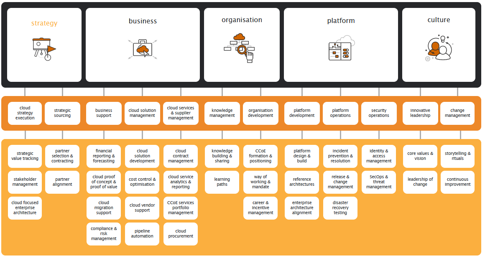

# Weolcan Cloud Adoption Framework
## https://www.youtube.com/watch?v=diuyvTtXj_w

## Wat is een Cloud Governance Framework?

De adoptie en migratie naar de Cloud is een stressvol en chaotisch traject als het "zo maar" word gedaan. Om dit meer streamlined en overzichtelijk te maken zijn er Cloud Governance Frameworks (CGF) gemaakt.

In een CGF word onder meer beschreven hoe specifieke aspecten van een Cloud adoptie behandeld worden met betrekking tot CGF. Hier onder is te zien over welke aspecten dit gaat:

  

We gaan per onderwerp in klein detail beschrijven wat het precies betekend voor een organisatie.

## Strategy
Voordat er technisch gemigreerd kan worden naar de Cloud, moet er een plan opgemaakt worden. In dit plan staan alle applicaties, diensten en servers die uiteindelijk in de Cloud terecht komen. In dit plan worden er een aantal aannames gemaakt over de verwachtte toegevoegde waarde en de haalbaarheid van de systemen in de Cloud.

Deze verwachtigen worden tijdens de executie geanalyseerd en gevolgd. Indien de verwachtingen niet gehaald worden word er onderzocht in welk onderdeel van de planning dit fout is gegaan. Op basis van dit onderzoek worden er eventueel verwachtingen of doelen bijgesteld.

Met betrekking tot stratagie word er ook een Cloud Leadership Team (CLT) opgesteld. Het taak van dit team is om de Governance effectiviteit te monitoren en het gebruik van de Public Cloud to motiveren en versnellen.

Het doel van het traject "Strategy" is om inzichtelijk te krijgen wat, hoe en wanneer de adoptie/migratie gaat plaatsvinden. 

## Business
Het business traject in de CGF is bedoelt om de budgetten en de financiele kant van de adoptie inzichtelijk te krijgen. Op basis van de resultaten van het financieel onderzoek is het mogelijk om beter geïnformeerde beslissingen te maken in de toekomst van de adoptie.

Tijdens het business traject van de adoptie worden er ook Proof of Concepts (PoC) uitgevoerd in een test omgeving. Het doel van de PoC's is om de daadwerkelijke haalbaarheid van het op-te-lossen probleem na te lopen. Ook worden de ta-maken rapportages, dashboards en monitoring aspecten hier bepaald.

## Organisation
Tijdens de "Oganization" fase word er geïnventariseerd welke kennis al aanwezig is in de organisatie. Dit word gedaan door middel van Key Performance Indicators (KPI's). Deze KPI's zijn bedoelt om kennis te inventariseren en te delen. 

Na de KPI's inzichtelijk zijn is er mogelijk een noodzaak voor training van het personeel. De noodzaak hier voor word ook bepaald in dit traject. 

## Platform
In deze fase worden de mogelijkheden en de tekortkomingen van het platform gelijk getrokken met de doelen en to-be van de organisatie. Ook worden de verantwoordelijkheden van de actoren hier in inzichtelijk gemaakt. (Ontwikkelaars, Cloud Architecten etc.) 

De toekomstige rechtenstructuur (IAM, AD) word hier ook inzichtelijk gemaakt.

## Culture
In deze fase worden de visie en de missie geanalyseerd en duidelijk gemaakt voor de organisatie samen met de waarden en de plannen van de eventuele toekomstige veranderingen. Ook de GAP word in deze fase gedefinieerd. 

Hier word ook het concept "Continuous-improvement" geïnventariseerd en eventueel geïmplementeerd. Dit is afhankelijk van de capaciteiten van de medewerkerd en de leden van het CLT.

# Vragen

1. **Wat is dit voor standaard/framework?**

    a. Een Cloud Adoption Framework. Bedoeld om vóór de migratie naar de Cloud inzichtelijk te hebben wat er precies moet gebeuren en kan gebeuren in de toekomstige situatie. 

2. **Hoe draagt dit bij aan de governance van cloud processen, componenten, services, business en de mensen die ermee werken?**

    a. Het Weolcan CGF forceert de gebruiker ervan om alle processen, componenten en services te definieren voordat de adoptie en/of migratie plaatsvind. Dit zorgt voor oneindig veel meer duidelijkheid voor de actoren die verantwoordelijk zijn voor de adoptie of migratie.

    De business (Organisatie) haalt uit dit CGF uiteindelijk ook meer profeit omdat er na de adoptie/migratie weinig tijd meer verspilt word aan het leren van of uitzoeken van de nieuwe Cloud systemen.

3. **Is het compleet, dat wil zeggen: Worden alle aspecten die met Governance te maken hebben afgedekt?**

    a. In het Weolcan CGF worden (naar onze mening) alle aspecten van Cloud Governance mee genomen en correct behandelt. 

4. **Wat zijn de sterke punten en wat is minder goed?**

    a. Het sterkte aan het Weolcan CGP is de grondigheid van de informatie. Onder elk aspect van hun CGP is een "Activities Checklist" te vinden met aspecten die je na het lezen of uitvoeren van hun CGP, moet kunnen definieren. 

    In deze checklist zijn ook twee secties gemaakt: "Initial" en "Recurring", deze houden bij welke er op het gegeven moment gedefinieerd zijn en welke later eventueel terug kunnen komen in latere stadia.

5. **Wat doen de grote public cloud providers eigenlijk met deze standaard/framework? Conformeren zij zich hieraan?**

    a. Als we kijken naar de Cloud Adoption Frameworks van bijvoorbeeld AWS en Azure, zijn ze in hoofd lijnen hetzelfde. Dit laat mij geloven dat Weolcan het op de correcte wijze ingericht heeft.

  

# Bronnen
https://www.youtube.com/watch?v=diuyvTtXj_w
https://www.weolcan.eu/en/en-home/
https://www.weolcan.eu/en/en-cloud-governance/
https://governance.weolcan.eu/
https://learn.microsoft.com/en-us/azure/cloud-adoption-framework/
https://aws.amazon.com/professional-services/CAF/

